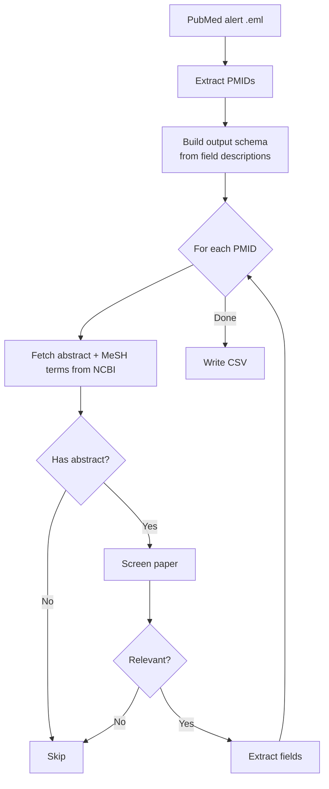

# PubMed Literature Screener

Screens PubMed alert emails for relevant papers and extracts structured information into a CSV using the Claude API. Specify your own screening criterion and output fields at runtime.

## Setup

**Requirements:** Python 3.8+

```bash
pip install -r requirements.txt
```

Copy `.env.example` to `.env` and add your [Anthropic API key](https://console.anthropic.com/):

```bash
cp .env.example .env
# edit .env and set ANTHROPIC_API_KEY
```

## Usage

Save your PubMed alert email as a `.eml` file (in Gmail: three-dot menu → Download message).

Specify your own screening criterion and output fields interactively:

```bash
python screen.py alert.eml
```

Use `--default` to skip the prompts and use schizophrenia genomics defaults:

```bash
python screen.py alert.eml --default
```

Override criterion and/or fields via flags:

```bash
python screen.py alert.eml --criterion "Is this about treatment-resistant schizophrenia?" --fields "methodology, sample_size, treatment, outcomes"
python screen.py alert.eml --output my_results.csv
```

## Output

The CSV contains one row per relevant paper. With `--default`, the columns are:

| Column | Description |
|---|---|
| `title` | Paper title |
| `url` | PubMed link |
| `pmid` | PubMed ID |
| `methodology` | General method (e.g. GWAS, scRNA-seq, proteomics) |
| `sample_type` | Tissue/sample type and origin |
| `causal_claims` | Statements about causes of schizophrenia inferred from the data |
| `genetics_claims` | Claims about specific genes, loci, or pathways |
| `summary` | 2-3 sentence plain-language summary for triage |

With custom fields, columns are derived from whatever fields you specify.

The CSV can be imported directly into Google Sheets (File → Import).

## Pipeline



## Known Limitations

- Papers without abstracts in PubMed are skipped silently.
