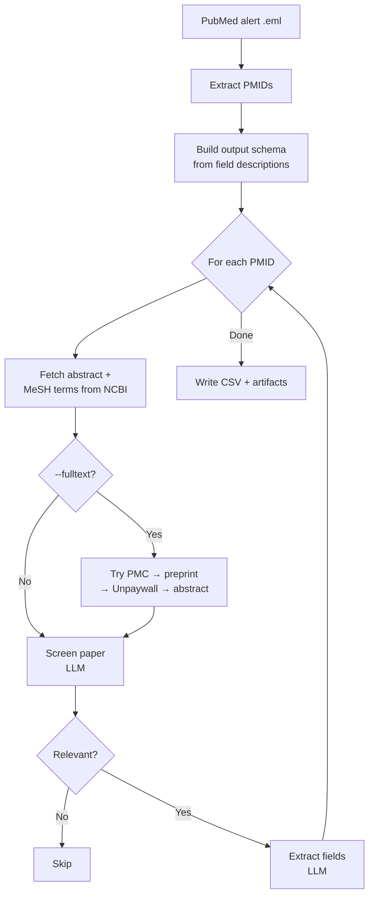

# PubMed Literature Screener

Screens PubMed alert emails for relevant papers and extracts structured information into a CSV. Supports multiple LLM providers and optional full-text retrieval.

## Setup

**Requirements:** Python 3.8+

Install the package (creates the `pubmed-screener` command):

```bash
pip install -e .
```

Copy `.env.example` to `.env` and add your API key:

```bash
cp .env.example .env
# edit .env and set ANTHROPIC_API_KEY (or OPENAI_API_KEY)
```

## Usage

Save your PubMed alert email as a `.eml` file (in Gmail: three-dot menu → Download message).

Use `--default` to run with schizophrenia genomics defaults (no prompts):

```bash
pubmed-screener alert.eml --default
```

Or specify criterion and fields interactively:

```bash
pubmed-screener alert.eml
```

Or pass them as flags:

```bash
pubmed-screener alert.eml --criterion "Is this about treatment-resistant schizophrenia?" --fields "methodology, sample_size, treatment, outcomes"
```

### Full-text retrieval

Use `--fulltext` to screen and extract from full text instead of just the abstract. The pipeline tries each source in order:

1. PMC JATS XML (open access)
2. Preprint XML (bioRxiv / medRxiv)
3. Unpaywall PDF (requires `--unpaywall-email`)
4. Abstract fallback

```bash
pubmed-screener alert.eml --default --fulltext --unpaywall-email you@example.com
```

Limit which sections are sent to the LLM:

```bash
pubmed-screener alert.eml --default --fulltext --sections methods,results
```

### LLM providers

The tool supports Anthropic (default), OpenAI, and local Ollama models:

```bash
# OpenAI
pubmed-screener pubmed.eml --default --provider openai --model gpt-4o

# Ollama (local)
pubmed-screener pubmed.eml --default --provider ollama --model llama3
```

You can also set `LLM_PROVIDER` and `LLM_MODEL` as environment variables.

## Output

Each run creates a timestamped directory (e.g. `run_20260313_142000/`) containing:

- `results.csv` — one row per relevant paper
- `artifacts/<pmid>/` — per-paper folder with the text sent to the LLM, metadata, and any retrieved full-text files

With `--default`, the CSV columns are:

| Column | Description |
|---|---|
| `title` | Paper title |
| `url` | PubMed link |
| `pmid` | PubMed ID |
| `doi` | DOI |
| `text_source` | Where the text came from (`abstract`, `pmc_fulltext`, `preprint_fulltext`, `unpaywall_pdf`) |
| `methodology` | General method (e.g. GWAS, scRNA-seq, proteomics) |
| `sample_type` | Tissue/sample type and origin |
| `causal_claims` | Statements about causes of schizophrenia inferred from the data |
| `genetics_claims` | Claims about specific genes, loci, or pathways |
| `summary` | 2-3 sentence plain-language summary for triage |

With custom fields, columns are derived from whatever fields you specify.

The CSV can be imported directly into Google Sheets (File → Import).

## Pipeline



## Known Limitations

- Papers without abstracts or accessible full text are skipped silently.
